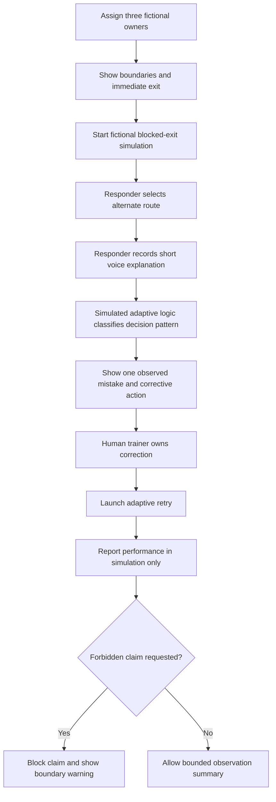
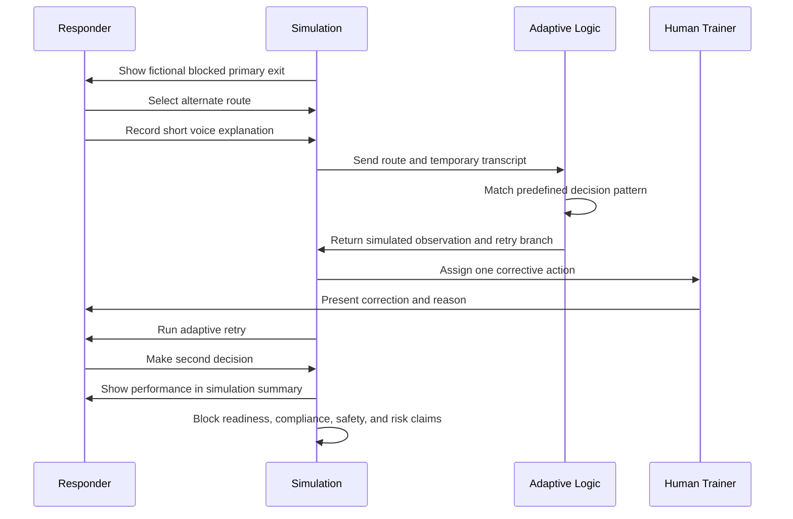

# Safe Exit Retry

**Business Bending - Week 6**  
**Student:** Fernanda Espinosa  
**Role:** Adversary  
**Status:** Packet before code

> **Boundary label used on every product screen:** PERFORMANCE IN SIMULATION

## Pre-build challenge: Does this slice honor the Adversary declaration?

The first version of this idea was not fully an Adversary build. A route-choice rehearsal with an adaptive retry mainly fulfilled the USER and TECHNOLOGIST declarations. To honor the Adversary declaration, the slice must also prevent simulated behavior from becoming proof of readiness.

The corrected slice includes a visible claim boundary and a forbidden-claim guard. It permits only observations about what happened inside the fictional scenario. It blocks labels such as "ready," "compliant," "competent," "safe," "certified," "survival probability," and "risk reduction." It also requires a named fictional human trainer to own the corrective action and the retry.

With these boundaries, the slice honors all six Blueprint conditions:

1. A measured gap creates a specific correction and retry.
2. Claims remain limited to the simulation.
3. The experience works as a low-cost browser simulation without special hardware.
4. Three fictional owners are assigned before the rehearsal begins.
5. The observed behavior and permitted use are defined before launch.
6. The shadow clause is visible and mechanically enforced.

## 1. Problem in my own words

Emergency training often records completion but does not show how a responder makes a decision when the expected route stops working. A simulation can expose that decision, but its result can easily be misused as proof that a person is ready for a real emergency. Safe Exit Retry creates one short rehearsal loop: decision, observed mistake, correction, and retry, while preventing the simulated result from becoming a readiness or compliance score.

## 2. Exact user

The exact user is **Lucia Hernandez**, a fictional 38-year-old floor response coordinator at a medium-sized office in Mexico City. She has completed standard evacuation drills, uses a phone and laptop comfortably, and is responsible for guiding coworkers during an exercise. She needs a short rehearsal that tests what she does when the primary exit becomes unavailable, without requiring a VR headset or claiming to predict her real-world performance.

Before launch, the fictional organization assigns:

- **Program owner:** Elena Ruiz, Preparedness Program Manager.
- **Operational owner:** Carlos Vega, Building Operations Manager.
- **Training/safety owner:** Tomas Leon, Civil Protection Trainer.

## 3. Success definition

**Before the module closes, the responder completes one fictional blocked-exit scenario, selects an alternative route, records a short voice explanation, receives one specific simulated correction owned by the fictional human trainer, and completes an adaptive retry. The final screen reports only observable performance in simulation and blocks readiness, compliance, competence, safety, survival, certification, and risk-reduction claims.**

The slice succeeds only if:

- The user can leave immediately from every scenario screen.
- The first decision changes the retry.
- Voice input changes which correction is shown.
- The correction names one observable mistake and one next action.
- The result is always labeled **Performance in simulation**.
- No total readiness score or real-world prediction appears.

## 4. Image-generated mockup plan

Create one image-generated desktop mockup showing the main decision screen.

### Image prompt

> A realistic but calm desktop web-app mockup for a fictional emergency training product called "Safe Exit Retry." Show a simple first-person hallway simulation inside a modern office. The main exit ahead is visibly blocked by light debris, without injuries, flames, panic, or graphic danger. Show three large route buttons: "Stair B," "Elevator," and "Wait here." Add a microphone panel that says "Explain your choice," a persistent "Exit simulation" button, and a clear amber label at the top: "PERFORMANCE IN SIMULATION - NOT A READINESS OR SAFETY SCORE." Clean accessible interface, high contrast, professional civil-protection training style, calm bounded intensity, no logos, no real people, no certification badge, no numerical score, 16:9 desktop layout.

### Required visible elements

- Product name: Safe Exit Retry.
- Boundary label: Performance in simulation.
- Fictional scenario label.
- Blocked primary exit.
- Three decision options.
- Voice explanation control.
- Immediate exit control.
- No readiness score, stars, badge, percentage, or certification language.

The generated image is stored with the working prototype and embedded here before the packet is exported to PDF:

```markdown

```

## 5. Feature flow as a Mermaid flowchart



## 6. Actor swimlane in Mermaid



## 7. Benchmark line

**The best existing solution on Earth for this is FEMA's HSEEP exercise-evaluation and improvement-planning loop, which connects observed exercise behavior to corrective action and retesting.**

**Safe Exit Retry differs by localizing that loop into a very small, low-cost browser rehearsal for a fictional Mexican institutional responder, adding an adaptive voice-supported retry and a mechanical claim boundary that prevents simulated performance from becoming a readiness score.**

Supporting benchmark: Japan's scenario-based disaster exercises demonstrate repeated rehearsal, while the Blueprint requires that Mexico adapt the method rather than copy foreign infrastructure or assumptions.

## 8. Three-sentence long view

In three years, Safe Exit Retry could become a library of short, device-independent rehearsal modules embedded in existing institutional training programs. Each module would connect one observable decision to a human-owned correction and a later retry, allowing trainers to improve exercises without claiming to predict real emergencies. The product would remain a rehearsal and improvement system, never an automatic certification, survival prediction, or replacement for physical drills.

## 9. Scope cut

### In scope

- One fictional office evacuation scenario.
- One blocked primary exit.
- Three predefined route choices.
- One short voice explanation.
- Temporary speech-to-text or typed fallback.
- One simulated adaptive classification.
- One human-owned correction.
- One adaptive retry.
- One bounded observation summary.
- A forbidden-claim guard.
- An immediate exit from the simulation.

### Not building

- An earthquake information app.
- A real emergency-response system.
- A real building evacuation plan.
- Live emergency alerts or dispatch.
- Real geolocation, maps, or personal data.
- A readiness, competence, compliance, safety, survival, or risk score.
- Automatic certification.
- Prediction of real-world behavior or casualties.
- Insurance pricing or loss-reduction claims.
- A VR headset requirement.
- A database, login, or stored voice recordings for this slice.
- Multiple buildings, scenarios, or user roles.

## 10. Architecture and Dragon Stack table

### Simple architecture

The prototype is a static browser application. All scenario data is fictional and stored locally in structured JSON. Route choice and the temporary voice transcript are evaluated in the browser by a transparent adaptive ruleset; no audio, transcript, or result is sent to a server or saved after the session.

| Layer | Free implementation | Role in the working slice | Why it is multiplicative |
|---|---|---|---|
| Interactive simulation | React/Vite or plain HTML/CSS/JavaScript with illustrated or short video states | Creates the blocked-exit rehearsal and route decision | Produces the behavior that can be observed |
| Adaptive logic | Transparent browser rules using route choice plus explanation patterns | Selects the correction and changes the retry | The retry cannot be selected without the simulated decision |
| Voice | Browser Web Speech API with typed fallback | Captures the responder's reason for choosing a route | The explanation changes the correction branch, not just the interface |
| Structured data | Local JSON scenario and permitted-observation schema | Defines choices, behaviors, corrections, and allowed claims before launch | Keeps measurement rules stable and testable |
| Claim boundary guard | Denylist plus allowlisted report template | Blocks prohibited labels and exports | Makes the Adversary condition functional rather than decorative |
| Hosting | Free static hosting | Provides the live URL | No server, secret, or paid service is required |

### Predefined behavior model

| Input pattern | Observable statement allowed | Corrective action | Retry change |
|---|---|---|---|
| Chooses elevator | Selected the elevator after the primary exit became unavailable | Review why elevators are excluded in this fictional exercise | Retry disables elevator and asks for a safe alternate route |
| Chooses to wait without checking | Did not select an available alternate route | Practice scanning for marked alternate exits | Retry highlights two route signs without naming the answer |
| Chooses Stair B but gives unsafe reason | Selected Stair B, but the explanation did not mention checking conditions | Practice stating the route check before moving | Retry adds a second blocked-path cue |
| Chooses Stair B with bounded safe reasoning | Selected the predefined safe alternative in this simulation | Repeat under one changed condition | Retry changes one environmental cue |

These statements describe only the fictional simulation. They are not proof of real-world readiness.

## 11. Test plan

### Mechanical pass

| Test | Action | Expected result |
|---|---|---|
| Start gate | Try to begin without three owners | Launch remains disabled and identifies missing owner roles |
| Exit control | Select Exit simulation from each scenario screen | Scenario closes immediately without penalty language |
| Route branch | Choose Elevator | Elevator-specific correction and retry appear |
| Voice branch | Choose Stair B and say a phrase that omits condition checking | Explanation-specific correction appears |
| Typed fallback | Deny microphone permission | User can type the explanation and continue |
| Adaptive retry | Make two different first-pass mistakes | Each mistake produces a different retry |
| Boundary label | Open every result and correction screen | Performance in simulation label remains visible |
| Claim guard | Attempt to label/export result as ready, compliant, safe, certified, or risk reduced | Action is blocked and boundary warning appears |
| Data persistence | Refresh after finishing | Voice transcript and session result are not retained |
| Input validation | Submit empty, very long, or unsupported text | Empty input is handled; text is length-limited and sanitized |

At least one discovered bug must be logged, fixed, committed, and redeployed before submission.

### Persona test

Synthetic persona: **Lucia Hernandez, 38, fictional office floor response coordinator in Mexico City. She has completed routine drills, uses a laptop comfortably, becomes impatient with long instructions, and worries that a low result could be used against her at work.**

Persona-test procedure:

1. Open a fresh chat with the persona description.
2. Paste screenshots of every screen in order.
3. Ask Lucia to attempt the task and narrate where she hesitates.
4. Log every confusion, especially around voice permission, the meaning of the observation, and whether the result feels like an employment score.
5. Fix the worst confusion.
6. Retest and document the change in `PERSONA_FernandaEspinosa.pdf`.

## 12. Blueprint conditions checklist

| Blueprint condition | Product requirement | Evidence before submission |
|---|---|---|
| 1. Visible correction | Every measured gap creates one specific action, a named fictional trainer, and a retry | Screenshots of correction and retry |
| 2. Bounded claims | Reports describe only behavior inside the simulation | Boundary labels and report copy |
| 3. Medium-agnostic and cost-disciplined | Browser simulation works without a headset; voice has typed fallback | Desktop/mobile tests and fallback test |
| 4. Explicit ownership | Program, operational, and training/safety owners are required before launch | Disabled start gate screenshot |
| 5. Metric validity | Route behavior, rule, and permitted use are defined in advance | Predefined behavior-model table and tests |
| 6. Shadow clause | Claim guard blocks readiness, compliance, safety, certification, survival, and risk claims; immediate exit remains available | Forbidden-claim test and exit test |

## 13. Shadow clause

Synthetic performance must never become an idol of preparedness. Safe Exit Retry reports only what the responder selected and explained inside one fictional, controlled scenario. It does not measure or predict real-world readiness, competence, compliance, safety, survival, or risk reduction.

Every result screen must show:

> **PERFORMANCE IN SIMULATION**  
> This observation describes one fictional rehearsal only. It is not a readiness, compliance, competence, safety, survival, certification, or risk-reduction result.

The application must block any attempt to replace this label with a prohibited claim. Intensity stays bounded: no injuries, panic, graphic danger, loud startle effects, or countdown pressure. An immediate **Exit simulation** control is visible throughout the rehearsal.

## 14. Security Floor checklist

- [ ] **No secrets in code or repository.** The slice uses no API keys. Voice processing stays in the browser where supported.
- [ ] **No unnecessary personal data.** All names, organizations, scenarios, and records are fictional and labeled.
- [ ] **Authentication decision documented.** The prototype stores no personal data, so authentication and a user database are intentionally out of scope.
- [ ] **RLS decision documented.** No Supabase table or database is used. If storage is added later, authentication and Row Level Security are required before launch.
- [ ] **Every input validates.** Owner names use fictional preset values; typed explanations have a strict length limit and are sanitized; unsupported input is rejected safely.
- [ ] **Voice privacy is explicit.** Audio is not uploaded or saved. The temporary transcript is cleared when the session ends or the user exits.
- [ ] **Simulated output is labeled.** Every adaptive observation and correction says it is simulated.
- [ ] **No real personal data in demo or seeds.** Only the fictional people named in this packet may appear.
- [ ] **Claim guard tested.** Prohibited readiness, compliance, safety, survival, certification, and risk-reduction language is blocked.

## Packet gate before implementation

Code may begin only after:

- The image-generated mockup has been added to `docs/assets/` and embedded in this packet.
- The flowchart and swimlane render correctly on GitHub.
- The benchmark line and sources are retained.
- All six Blueprint conditions have an observable product requirement.
- The test plan contains the future bug-fix-redeploy evidence fields.
- The Security Floor checklist is accepted.
